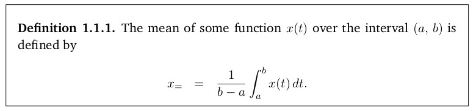
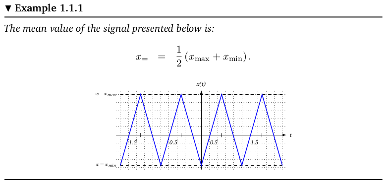
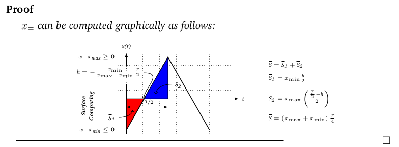
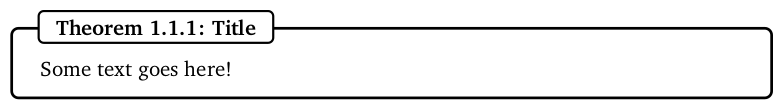

## Installation

A quick guide on how to install LaTeX distribution depending on the OS your machine is running.

<center>

[](https://www.tug.org/texlive/)
[](https://www.tug.org/mactex/)
[](https://www.tug.org/protext/)

</center>

Below are links to two useful apps to draw schemes in Tikz and to manage bibliography DB through semi-WYSIWYG editors.

-   _Tikz Editor:_ [TikzEdt](http://www.tikzedt.org/ "Link to TikzEdt")

-   _Bibliography Manager:_ [JabRef](http://www.jabref.org/ "Link to JabRef")


Hints on how to write some mathematical environments.

**Definition**

```LaTeX
\begin{Def}{}
The mean of some function $x(t)$ over the interval $(a,\, b)$ is defined by
  \begin{eqnarray*}
    x_{=} &=& {\frac{1}{b-a}}\int_{a}^{b}x(t)\,dt.
  \end{eqnarray*}
\end{Def}
```

<center>

</center>

**Example**

```latex
\begin{Exmp}
The mean value of the signal presented below is:

\begin{eqnarray*}
  x_{=} &=& \frac{1}{2}\left(x_{\max}+x_{\min}\right).
\end{eqnarray*}

\begin{center}
  \begin{tikzpicture}[xscale=1.5, yscale=1.5]
  		\draw[step=0.2,black,dotted] (-2.1,-0.85) grid (2.1,1.1);
  		\draw[-latex] (-2.1,0) -- (2.1,0)node[right, font=\tiny]{t};
  		\draw[-latex] (0,-0.85) -- (0,1.1)node[above, font=\tiny]{x(t)};
  		\draw[dashed] (-2,1)node[left,font=\tiny] {$x$=$x_\text{max}$} -- (2,1);
  		\draw[dashed] (-2,-0.75)node[left,font=\tiny] {$x$=$x_\text{min}$} -- (2,-0.75);
  		\draw[thick, blue] (-2,-0.75)--(-1.5,1)--(-1,-0.75)--(-0.5,1)--(0,-0.75)--(0.5,1)--(1,-0.75)--(1.5,1)--(2,-0.75);
  		\foreach \x in {-1.5,-0.5,0.5,1.5}{\draw (\x,-0.05)node [below left,font=\tiny,] {\x} -- (\x,0.05); }
  \end{tikzpicture}
\end{center}

\end{Exmp}
```

<center>

</center>

**Proof**

```LaTeX
\begin{Proof*}{}
$x_{=}$ can be computed graphically as follows:

    \begin{center}
    	\begin{tikzpicture}
    		\begin{scope}[xscale=3, yscale=1.5]
    		\node[rotate=90,font=\tiny\bfseries] at (-0.465,-0.165) {\begin{tabular}{ccc}Surface\\Computing\end{tabular}};
    		\draw[step=0.2,black,dotted] (-0.1,-0.85) grid (1.25,1.1);
    		\draw[-latex] (-0.1,0) -- (1.35,0)node[right, font=\tiny]{t};
    		\draw[-] (0,-0.85)--(0,0.35); \draw[-latex] (0,0.775)--(0,1.1)node[above, font=\tiny]{x(t)};
    		\draw[dashed] (-0.1,1)node[left,font=\tiny] {$x$=$x_\text{max}\geq 0$} -- (1.25,1);
    		\draw[dashed] (-0.1,-0.75)node[left,font=\tiny] {$x$=$x_\text{min}\leq 0$} -- (1.25,-0.75);
    		\draw[thick] (0,-0.75)--(0.5,1)--(1,-0.75);
    		\draw[fill=red](0,-0.75)--(0.21,0)--(0,0)--(0,-0.75);
    		\draw[fill=blue](0.21,0)--(0.5,1)--(0.5,0)--(0.21,0);
    		\node[above, font=\tiny] at (0.275,-0.25) {$\nicefrac{\text{T}}{2}$};
    		\node[font=\tiny] (s1) at (-0.175,-0.45) {$\overline{\text{S}}_\text{1}$}; \draw[->](s1) to [out=0,in=-90](0.075,-0.275);
    		\node[font=\tiny] (s2) at (0.625,0.35) {$\overline{\text{S}}_\text{2}$}; \draw[->](s2) to [out=180,in=90](0.355,0.115);
    		\draw[latex-latex](0,-0.2)--(0.5,-0.2);
    		\node[font=\tiny] (h) at(-0.215,0.625) {$\text{h}=-\frac{x_{\min}}{x_{\max}-x_{\min}}\frac{\text{T}}{2}$}; \draw[->](h) to [out=0,in=90](0.21,0);
    		\end{scope}
    %
    		\begin{scope}[xshift=5cm]
    		\node[right,font=\tiny] at(0,1.25) {$\overline{\text{S}}=\overline{\text{S}}_\text{1}+\overline{\text{S}}_\text{2}$};
    		\node[right,font=\tiny] at(0,0.75) {$\overline{\text{S}}_\text{1}=x_{\min}\frac{\text{h}}{2}$};
    		\node[right,font=\tiny] at(0,0) {$\overline{\text{S}}_\text{2}=x_{\max}\left(\frac{\frac{\text{T}}{2}-\text{h}}{2}\right)$};
    		\node[right,font=\tiny] at(0,-0.7) {$\overline{\text{S}}=\left(x_{\max}+x_{\min}\right)\frac{\text{T}}{4}$};
    		\end{scope}
      \end{tikzpicture}
    \end{center}

\end{Proof*}
```

<center>

</center>

**Theorem**

```latex
\begin{Thm}[label={thm:label}]{Title}
Some text goes here!  
\end{Thm}
```

<center>

</center>
