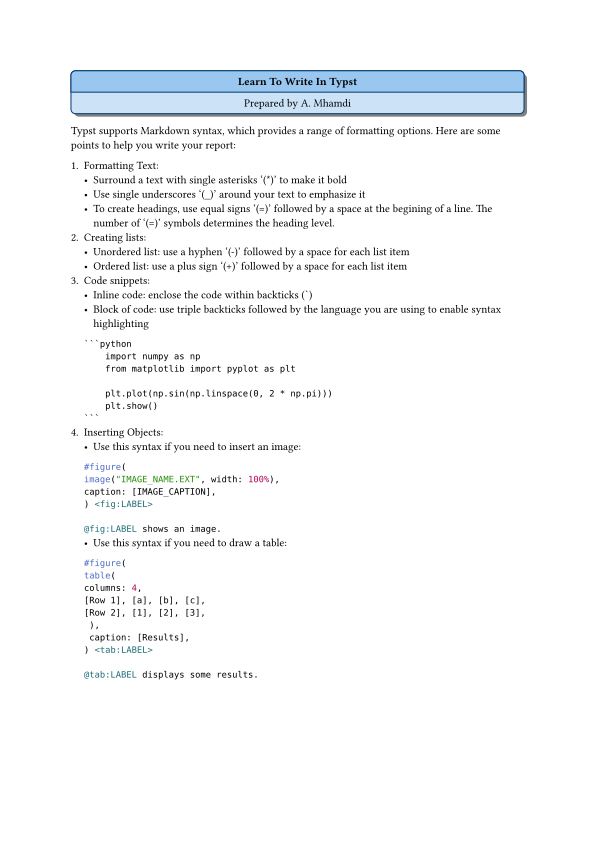

`Typst` version 0.12. was used to create the supplied templates.

The ebook at [https://sitandr.github.io/typst-examples-book/book/about.html](https://sitandr.github.io/typst-examples-book/book/about.html), provides an extended tutorial and many `Typst` code snippets to write well you document.
